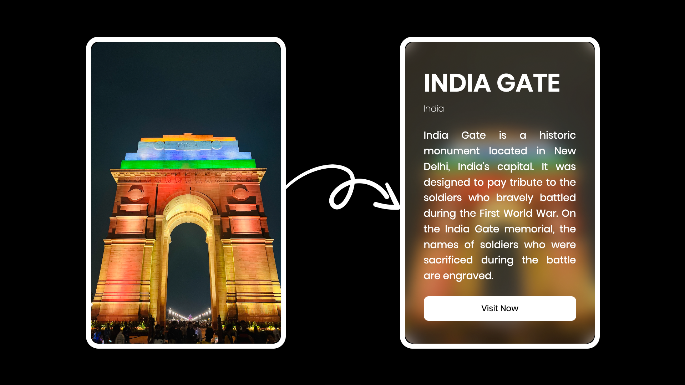

# Simple Card Hover Effect | Stunning Card Hover Effect with ease

A simple card hover effect, also known as a stunning card hover effect, is a visually appealing and interactive design technique used to enhance the appearance of card components on a webpage. By applying CSS transitions and transformations, developers can create elegant and dynamic animations that occur when a user hovers over a card element. This effect is typically used to provide additional visual feedback and interactivity, such as scaling, rotating, or applying shadow effects, to make the card stand out and grab the user's attention. The simple card hover effect serves to improve the overall user experience by adding a layer of sophistication and engagement to the website's design. It is commonly utilized for various types of content presentation, including product displays, image galleries, or information cards, to create a visually appealing and modern user interface that encourages user interaction and exploration.

Live Preview: https://simplecardhovereffect.vercel.app/

